<picture>
  <source media="(prefers-color-scheme: dark)" srcset="dark.svg">
  <source media="(prefers-color-scheme: light)" srcset="light.svg">
  
</picture>

  &nbsp;&nbsp;
  

### 📊 GitHub Stats

<picture>
  <source media="(prefers-color-scheme: dark)" srcset="https://streak-stats.demolab.com?user=variablePotato&theme=transparent&hide_border=true&background=0A101F&ring=10B981&fire=22D3EE&currStreakNum=10B981&currStreakLabel=22D3EE&sideNums=E2E8F0&sideLabels=94A3B8&dates=94A3B8">
  <source media="(prefers-color-scheme: light)" srcset="https://streak-stats.demolab.com?user=variablePotato&theme=transparent&hide_border=true&background=F8FAFC&ring=10B981&fire=0891B2&currStreakNum=10B981&currStreakLabel=0891B2&sideNums=0F172A&sideLabels=64748B&dates=64748B">
  
</picture>

  <picture>
    <source media="(prefers-color-scheme: dark)" srcset="https://github-readme-stats-lovat-ten-84.vercel.app/api?username=variablePotato&show_icons=true&hide_border=true&bg_color=0A101F&title_color=10B981&text_color=E2E8F0&icon_color=22D3EE&hide_rank=true">
    <source media="(prefers-color-scheme: light)" srcset="https://github-readme-stats-lovat-ten-84.vercel.app/api?username=variablePotato&show_icons=true&hide_border=true&bg_color=F8FAFC&title_color=10B981&text_color=0F172A&icon_color=0891B2&hide_rank=true">
    
  </picture>
  <picture>
    <source media="(prefers-color-scheme: dark)" srcset="https://github-readme-stats-lovat-ten-84.vercel.app/api/top-langs/?username=variablePotato&layout=compact&hide_border=true&bg_color=0A101F&title_color=10B981&text_color=E2E8F0">
    <source media="(prefers-color-scheme: light)" srcset="https://github-readme-stats-lovat-ten-84.vercel.app/api/top-langs/?username=variablePotato&layout=compact&hide_border=true&bg_color=F8FAFC&title_color=10B981&text_color=0F172A">
    
  </picture>

### 🐍 Contribution Activity

<picture>
  <source media="(prefers-color-scheme: dark)" srcset="https://raw.githubusercontent.com/variablePotato/variablePotato/output/github-contribution-grid-snake-dark.svg">
  <source media="(prefers-color-scheme: light)" srcset="https://raw.githubusercontent.com/variablePotato/variablePotato/output/github-contribution-grid-snake.svg">
  
</picture>
